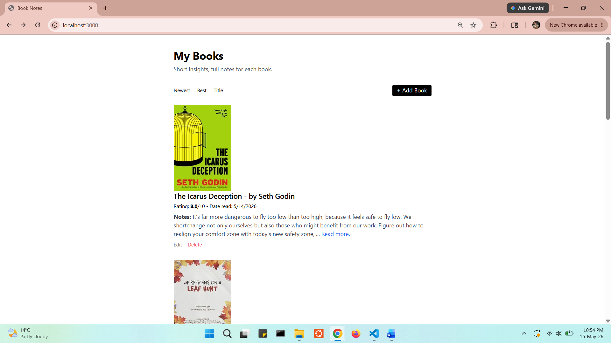
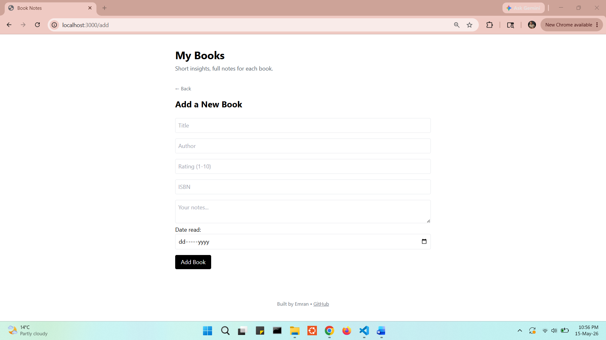
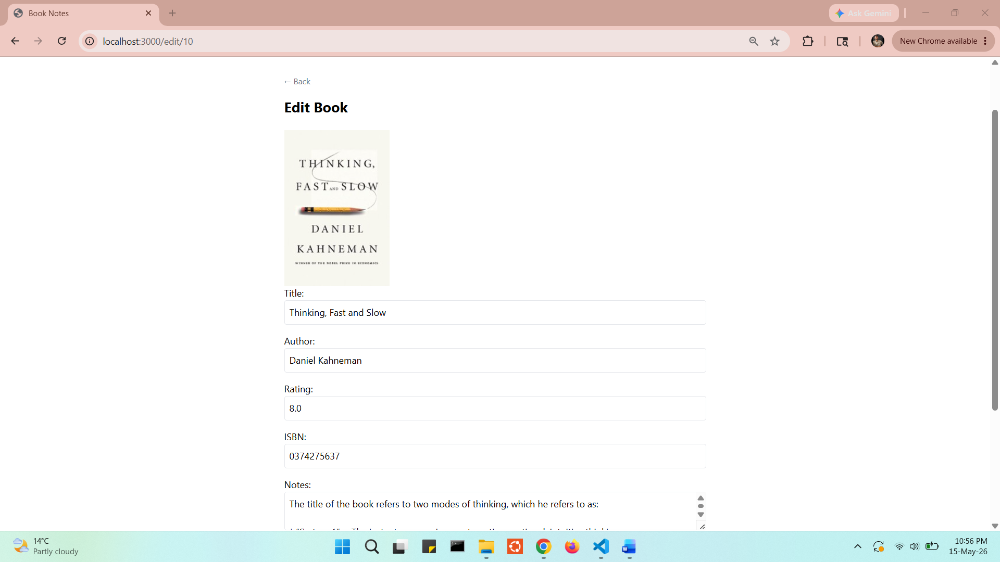
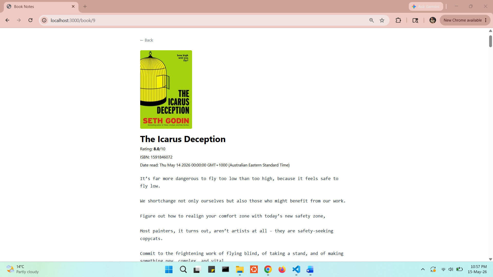

# Book Notes
Save all the books read so far and the notes taken while reading  


## About
Book Notes is a full-stack web app inspired by [Derek Sivers’ book notes](https://sive.rs/book).  
It tackles the problem of forgetting most of a book soon after reading it.  
Storing notes together with a rating and date read makes recalling key ideas easier.  

This was built as a capstone project for Angela Yu's Web Development Bootcamp.

## Tech Stack
- **Frontend:** EJS, Tailwind CSS
- **Backend:** Node.js, Express
- **Database:** PostgreSQL

## Project Structure
- [db.js](db.js) - Connecting to postgresql Database
- [index.js](index.js) - Main backened logic from starting the server to routing, data manipulaiton, and serving data are handled. 
- [queries.sql](queries.sql) - Queries used to setup database
- views/ -
- [index.ejs](./views/index.ejs) - Home page 
- [add.ejs](./views/add.ejs) - Add new books page 
- [edit.ejs](./views/edit.ejs) - Update existing books page 
- [partials/](./views/partials) - Reusable Header and Footer 

## Installation

1. Clone the repo by using `git clone` in terminal with git installed:
    ```bash
    git clone https://github.com/talukderemran61/book_notes.git
    ```
2. Navigate into the folder
    ```bash
    cd book_notes
    ```
3. Install dependencies
    ```bash
    npm install
    ```
4. Setup the postgres database
    - Start `pdAdmin` desktop app
    - Create a Database named `booknotes`
    - Select `booknotes` and open query editor
    - Copy & paste all the queries fron `queries.sql` file to create books table and seed data
5. Create a `.env` file next to `index.js` file and add the environment variable. (optional)  
    `.env.example` file is there as an example how to configure the variables. 
6. Repace the password with your own in `db.js` (database connection file)
    ```bash
    const db = new pg.Client({
        connectionString: process.env.DATABASE_URL || 'postgresql://postgres:<your_postgres_password>@localhost:5432/booknotes',
    });
    ```
    Replace `<your_postgres_password>` with the password you used to configure pgAdmin.
7. start the app
    ```bash
    npm start
    ```
    Visit `http://localhost:3000`

## Usage
- Add new books read
- Edit/Update previously added books
- Delete existing books
- Sort books read by recency (default), rating, alphabatically

## Contact
Emran Talukdar - emrant31@gmail.com(prefered) - [LinkedIn](https://www.linkedin.com/in/emran-talukdar/)

## Demo
1. Home/Landing page with all the books, Sort books, add, edit, and delete book features


2. Add new book


3. Edit existing books


4. Book page with full notes
